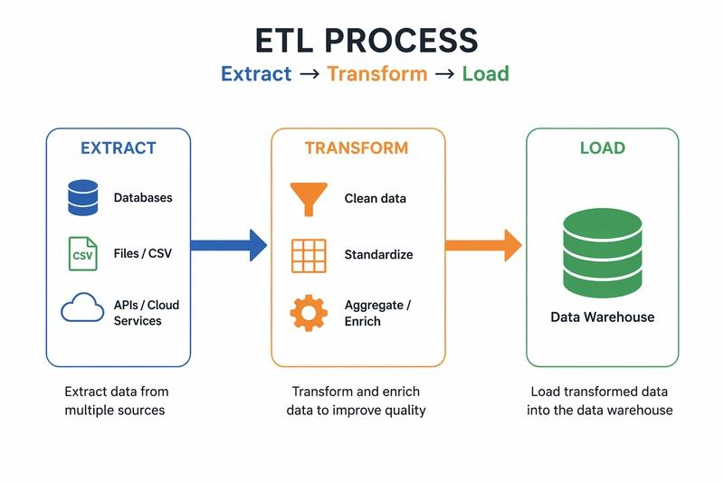
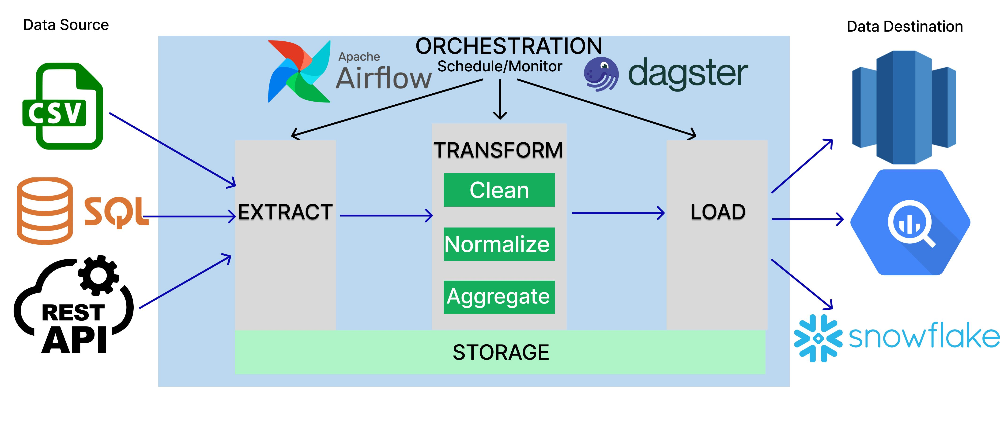

**ETL** stands for:

* **E** – Extract
* **T** – Transform
* **L** – Load

It is the process of moving data from one or more source systems into a data warehouse or another destination for analysis.

## ETL in one picture

```text
           Extract              Transform                  Load

+-----------+                  +----------------+         +------------------+
| MySQL DB  |                  | Clean data     |         | Data Warehouse   |
+-----------+                  | Remove nulls   |         |                  |
                               | Convert dates  |-------> | Sales Table      |
+-----------+                  | Join tables    |         | Customer Table   |
| CSV Files | ------->         | Calculate KPIs |         | Reports          |
+-----------+                  +----------------+         +------------------+

+-----------+
| APIs      |
+-----------+
```





---

## Step 1: Extract

Collect data from different sources.

For example, a company has:

* Sales database
* Customer database
* Excel files
* APIs
* CSV files

Example:

### Sales table

| Order ID | Customer | Amount |
| -------- | -------- | ------ |
| 101      | Alice    | 500    |
| 102      | Bob      | 800    |

### Customer table

| Customer | City    |
| -------- | ------- |
| Alice    | Chennai |
| Bob      | Delhi   |

At this stage, nothing has changed yet—you've simply copied the data from the source systems.

---

## Step 2: Transform

Now the extracted data is cleaned and prepared.

Examples of transformations:

### Remove duplicate rows

Before

| ID | Name  |
| -- | ----- |
| 1  | Alice |
| 1  | Alice |

After

| ID | Name  |
| -- | ----- |
| 1  | Alice |

---

### Fill missing values

Before

| Customer | City |
| -------- | ---- |
| Alice    | NULL |

After

| Customer | City    |
| -------- | ------- |
| Alice    | Unknown |

---

### Convert formats

Before

```
07/19/2026
```

After

```
2026-07-19
```

---

### Join multiple tables

Sales

| Order | Customer | Amount |
| ----- | -------- | ------ |
| 101   | Alice    | 500    |

Customers

| Customer | City    |
| -------- | ------- |
| Alice    | Chennai |

Result

| Order | Customer | City    | Amount |
| ----- | -------- | ------- | ------ |
| 101   | Alice    | Chennai | 500    |

---

### Create new columns

Example:

```
GST = Amount × 18%
```

If Amount = 1000

GST = 180

Total = 1180

---

## Step 3: Load

After cleaning, the transformed data is stored in the destination.

```text
Sales Database
       |
Customer Database
       |
CSV Files
       |
      ETL
       |
       V
+----------------------+
| Data Warehouse       |
|----------------------|
| Sales Fact           |
| Customer Dimension   |
| Product Dimension    |
+----------------------+
```

Analysts and BI tools then query the warehouse instead of the operational databases.

---

## Real-world example

Imagine you're running an online shopping company.

Every day:

* 5 million orders are placed.
* Customer information is updated.
* Product prices change.
* Payments are processed.

At night, an ETL job runs:

1. **Extract** all today's orders and customer data.
2. **Transform** by:

   * Removing duplicate records
   * Correcting invalid values
   * Standardizing date formats
   * Calculating revenue
3. **Load** the cleaned data into the data warehouse.

The next morning, managers can view dashboards showing:

* Total sales today
* Top-selling products
* Revenue by city
* Customer growth

---

## ETL example in SQL

Suppose you have two source tables:

### `orders`

| order_id | customer_id | amount |
| -------- | ----------- | ------ |
| 101      | 1           | 500    |
| 102      | 2           | 700    |

### `customers`

| customer_id | name  | city    |
| ----------- | ----- | ------- |
| 1           | Alice | Chennai |
| 2           | Bob   | Delhi   |

### Transformation

```sql
SELECT
    o.order_id,
    c.name,
    c.city,
    o.amount
FROM orders o
JOIN customers c
ON o.customer_id = c.customer_id;
```

Result:

| Order | Customer | City    | Amount |
| ----- | -------- | ------- | ------ |
| 101   | Alice    | Chennai | 500    |
| 102   | Bob      | Delhi   | 700    |

This result can then be loaded into the data warehouse.

---

## ETL vs ELT

| ETL                            | ELT                                       |
| ------------------------------ | ----------------------------------------- |
| Transform before loading       | Load first, transform later               |
| Best for traditional systems   | Common in modern cloud data warehouses    |
| Requires a separate ETL server | Uses the warehouse's own processing power |
| Example: Informatica, Talend   | Example: Snowflake, BigQuery, Redshift    |

### Summary

```
Data Sources
     │
     ▼
Extract
     │
     ▼
Transform
     │
     ▼
Load
     │
     ▼
Data Warehouse
     │
     ▼
Reports / Dashboards / Analytics
```

Think ETL as a **data preparation pipeline**: it gathers raw data from multiple systems, cleans and combines it, and stores it in a format that's fast and reliable for reporting and analysis.
