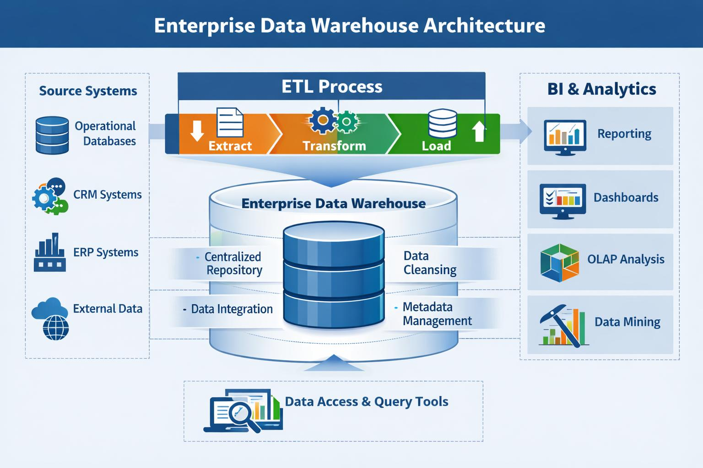

A **data warehouse** is a centralized repository that stores large amounts of data collected from multiple sources, organized specifically for **reporting, analytics, and business intelligence (BI)**.

Unlike a regular database, which is optimized for day-to-day transactions (such as processing orders or updating customer information), a data warehouse is optimized for answering complex questions and identifying trends over time.

### Simple analogy

Imagine a retail company:

* **Operational databases** are like the cash registers in each store—they record every sale as it happens.
* **Data warehouse** is like the company's headquarters, where sales data from all stores is combined, cleaned, and organized so executives can analyze performance.

### How a data warehouse works

1. **Extract** data from different sources:

   * Sales databases
   * CRM systems
   * Marketing platforms
   * ERP systems
   * External data sources

2. **Transform** the data:

   * Clean errors
   * Standardize formats
   * Remove duplicates
   * Combine related information

3. **Load** the transformed data into the warehouse.

This process is commonly called **ETL (Extract, Transform, Load)**, or **ELT** in modern cloud architectures.

### Example

Suppose an online retailer wants to answer questions like:

* Which products sold best last quarter?
* Which regions generate the highest revenue?
* How has customer spending changed over the last five years?

The warehouse might combine data like this:

| Source             | Data                  |
| ------------------ | --------------------- |
| Sales system       | Orders, revenue       |
| Customer database  | Customer demographics |
| Marketing platform | Campaign performance  |
| Inventory system   | Stock levels          |

Instead of querying each system separately, analysts query the data warehouse.

### Benefits

* Centralized, consistent data
* Faster analytical queries
* Historical data storage
* Better business reporting and dashboards
* Supports machine learning and advanced analytics
* Doesn't slow down operational systems

### Data warehouse vs. database

| Database                      | Data Warehouse                             |
| ----------------------------- | ------------------------------------------ |
| Handles daily transactions    | Handles analytics and reporting            |
| Frequently updated            | Updated periodically in batches or streams |
| Current operational data      | Historical and aggregated data             |
| Optimized for inserts/updates | Optimized for complex queries              |

### Popular data warehouse technologies

Some widely used platforms include:

* Snowflake
* Google BigQuery
* Amazon Redshift
* Microsoft Azure Synapse Analytics
* Oracle
* Teradata

