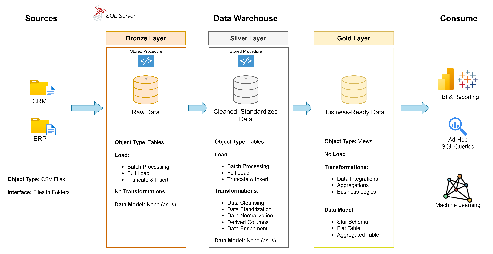

This diagram shows a **Modern Data Warehouse Architecture** following the **Medallion Architecture (Bronze → Silver → Gold)**. It is one of the most commonly used architectures in companies for reporting, analytics, dashboards, and machine learning.

---

# Data Warehouse Architecture (Detailed Notes)

## What is a Data Warehouse?

A **Data Warehouse (DW)** is a centralized repository where data from multiple sources is collected, cleaned, transformed, and organized for analysis.

Unlike an OLTP database, a data warehouse is designed for:

* Business Intelligence (BI)
* Reporting
* Historical Analysis
* Machine Learning
* Data Analytics
* Decision Making

---

# Overall Architecture

```text
                DATA WAREHOUSE PIPELINE

 ┌──────────────┐
 │  CRM System  │
 ├──────────────┤
 │  ERP System  │
 ├──────────────┤
 │ CSV Files    │
 ├──────────────┤
 │ APIs         │
 ├──────────────┤
 │ Excel Files  │
 └──────┬───────┘
        │
        ▼
==============================
      BRONZE LAYER
==============================
Raw Data Storage
(No Transformations)

        │
        ▼
==============================
      SILVER LAYER
==============================
Cleaned Data
Standardized Data
Validated Data

        │
        ▼
==============================
       GOLD LAYER
==============================
Business Ready Data

        │
        ▼
 Dashboards
 Reports
 SQL Queries
 Machine Learning
```

---

# Step 1 — Source Layer

The source layer contains the original business systems.

Examples

* CRM
* ERP
* HR System
* Banking System
* POS System
* CSV Files
* Excel Files
* REST APIs
* JSON Files
* IoT Devices

Example

Imagine Amazon.

Customer orders come from

```
Website
Mobile App
Payment Gateway
Inventory System
Shipping System
```

All of these become data sources.

---

## In the Image

Object Type

```
CSV Files
```

Interface

```
Files in Folder
```

Meaning:

Every day,

```
Customer.csv
Orders.csv
Products.csv
```

are copied into a folder.

Stored Procedures later load them into SQL Server.

---

# Bronze Layer

## Purpose

The Bronze layer stores data exactly as received.

Think of it as

> "Take the data and store it."

No modifications.

---

## Why Keep Raw Data?

Suppose today's file contains

| CustomerID | Name |
| ---------- | ---- |
| 101        | John |

Tomorrow someone accidentally deletes John.

If we only kept cleaned data,

John would disappear forever.

Bronze preserves the original copy.

---

## Characteristics

### Raw

No cleaning

Example

```
CustomerID

101
101
NULL
ABC
```

Everything is accepted.

---

### Object Type

Tables

Example

```
bronze_customer

bronze_orders

bronze_sales

bronze_product
```

---

### Loading

Image says

Batch Processing

Meaning

Run every night.

Example

```
12 AM

Read CSV

Insert into Bronze
```

---

### Full Load

Deletes old records

Loads everything again.

Example

Yesterday

```
100 customers
```

Today

```
110 customers
```

Load all 110 again.

---

### Truncate + Insert

Example

```sql
TRUNCATE TABLE bronze_customer;

INSERT INTO bronze_customer
SELECT *
FROM csv_customer;
```

---

### Transformations

None

No

* Rename
* Remove duplicates
* Format dates
* Remove nulls

Everything stays.

---

### Data Model

None

Tables match source exactly.

Source

```
CustomerID
Cust_Name
DOB
```

Bronze

```
CustomerID
Cust_Name
DOB
```

---

## Stored Procedure

The image shows

```
Stored Procedure
```

Example

```sql
CREATE PROCEDURE LoadBronzeCustomer
AS
BEGIN

TRUNCATE TABLE bronze_customer;

INSERT INTO bronze_customer
SELECT *
FROM staging_customer;

END;
```

Job Scheduler

↓

Stored Procedure

↓

Bronze Table

---

# Silver Layer

## Purpose

Convert raw data into trusted data.

This is where data engineering mostly happens.

---

## Goal

```
Raw Data

↓

Clean

↓

Standardize

↓

Validate

↓

Business Rules

↓

Silver
```

---

## Object Type

Tables

Example

```
silver_customer

silver_sales

silver_product
```

---

# Transformations

## 1. Data Cleansing

Remove errors.

Before

| CustomerID | Name |
| ---------- | ---- |
| 101        | John |
| 101        | John |
| NULL       | Mike |

After

| CustomerID | Name |
| ---------- | ---- |
| 101        | John |

Duplicates removed.

NULL removed.

---

## 2. Standardization

Different formats become one.

Example

Before

```
USA
United States
US
```

After

```
USA
USA
USA
```

Dates

```
2025/01/10

10-01-2025

Jan 10 2025
```

↓

```
2025-01-10
```

---

## 3. Normalization

Split repeated information.

Instead of

```
Customer

City

Country

```

Repeated 1 million times,

Create

```
City Table

Country Table

Customer Table
```

---

## 4. Derived Columns

Create new columns.

Example

```sql
Age =
CurrentDate - DOB
```

or

```sql
Profit

=

Revenue

-

Cost
```

---

## 5. Data Enrichment

Add additional information.

Example

Customer table

```
CustomerID

Name
```

Location table

```
CustomerID

State
```

Join them.

Now

```
Customer

Name

State
```

---

# Silver Example

Raw Orders

| ID | Date    | Amount |
| -- | ------- | ------ |
| 1  | 10/1/25 | 100    |
| 1  | 10/1/25 | 100    |
| 2  | NULL    | 250    |

After Silver

| ID | Date       | Amount |
| -- | ---------- | ------ |
| 1  | 2025-01-10 | 100    |

Duplicates removed.

Date standardized.

NULL removed.

---

# Stored Procedure

Example

```sql
INSERT INTO silver_customer

SELECT DISTINCT
CustomerID,
UPPER(Name),
CAST(DOB AS DATE)

FROM bronze_customer

WHERE CustomerID IS NOT NULL;
```

---

# Gold Layer

Purpose

Business-ready data.

This is what reports use.

---

Unlike Bronze and Silver,

Gold usually stores

Views

instead of physical tables.

Reason

No need to duplicate data.

Views always show the latest data.

---

# Business Logic

Example

Raw Sales

```
Order

Customer

Product

Amount
```

Gold

```
Monthly Sales

Top Customers

Revenue by Region

Yearly Profit
```

---

# Aggregation

Example

Silver

```
100 million sales rows
```

Gold

```
Sales by Month
```

Only

```
12 rows
```

Much faster.

Example SQL

```sql
SELECT
YEAR(order_date),
MONTH(order_date),
SUM(amount)

FROM silver_sales

GROUP BY
YEAR(order_date),
MONTH(order_date);
```

---

# Data Integration

Join multiple systems.

Example

CRM

```
Customer
```

ERP

```
Orders
```

Inventory

```
Stock
```

↓

Gold

```
Customer Dashboard
```

---

# Data Models

The image lists

---

## Star Schema

```
          Product
             │
Customer ─ Sales ─ Time
             │
          Store
```

Fact table

```
Sales
```

Dimension tables

```
Customer

Product

Time

Store
```

Most common warehouse model.

---

## Flat Table

Everything in one table.

```
Customer

Product

Sales

Region

Date

Profit
```

Simple

Fast for Power BI.

---

## Aggregated Table

Already summarized.

Example

```
Monthly Revenue
```

instead of

```
Every Order
```

---

# Gold Example View

```sql
CREATE VIEW vw_monthly_sales AS

SELECT

YEAR(order_date) Year,

MONTH(order_date) Month,

SUM(amount) Revenue

FROM silver_sales

GROUP BY

YEAR(order_date),

MONTH(order_date);
```

---

# Consumption Layer

The final users never query Bronze.

They usually use Gold.

Consumers include:

## 1. Power BI

Creates dashboards

Examples

```
Sales Dashboard

Customer Dashboard

Finance Dashboard
```

---

## 2. SQL Users

Analysts

```sql
SELECT *

FROM vw_monthly_sales;
```

---

## 3. Machine Learning

Data scientists train models using trusted data.

Examples

* Customer churn prediction
* Sales forecasting
* Fraud detection
* Product recommendations

---

# End-to-End Data Flow

```text
CSV / CRM / ERP
       │
       ▼
Stored Procedure
       │
       ▼
Bronze Tables
(Raw Data)
       │
       ▼
Stored Procedure
       │
       ▼
Silver Tables
(Clean + Standardized)
       │
       ▼
Views / Aggregations
       │
       ▼
Gold Layer
(Business Ready)
       │
       ▼
Power BI
SQL Reports
Machine Learning
```

---

# Why Three Layers?

| Layer      | Purpose                               | Transformations                     | Users                                          |
| ---------- | ------------------------------------- | ----------------------------------- | ---------------------------------------------- |
| **Bronze** | Preserve original source data         | None                                | Data Engineers                                 |
| **Silver** | Clean, validate, standardize, enrich  | Moderate                            | Data Engineers, Analysts                       |
| **Gold**   | Business-ready, aggregated, optimized | Business logic, joins, aggregations | Business Users, BI Developers, Data Scientists |

---

# Typical Daily ETL Workflow

1. **Extract**: Collect data from CRM, ERP, CSV files, APIs, etc.
2. **Load to Bronze**: Store the raw data exactly as received (full load or incremental load).
3. **Transform to Silver**: Clean invalid records, standardize formats, remove duplicates, enrich data, and apply validation rules.
4. **Build Gold**: Create business-focused views, star schemas, and aggregated datasets.
5. **Consume**: Dashboards (Power BI/Tableau), SQL reports, ad-hoc analysis, and machine learning models query the Gold layer.

---

