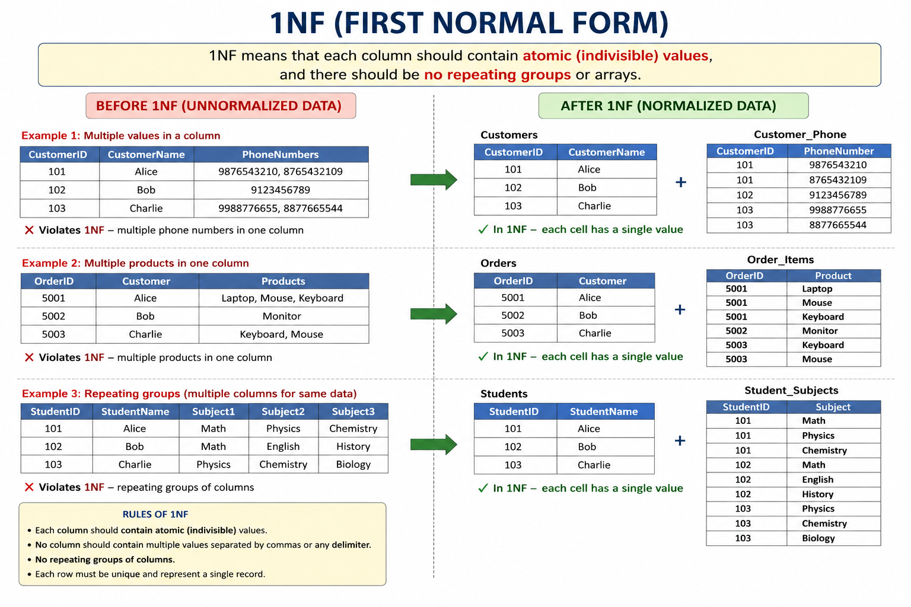

# What is 1NF?

**1NF = First Normal Form**

The main idea is:

> **Every column should contain a single, atomic value, and each row should represent one record.**

There are two things you should focus on:

1. **No multiple values in a single cell**
2. **No repeating groups of columns**

Let's see this with examples.

---

# Example 1 — Multiple values in one column

Suppose we have a `Customers` table:

| customer_id | customer_name | phone_numbers          |
| ----------- | ------------- | ---------------------- |
| 101         | Alice         | 9876543210, 8765432109 |
| 102         | Bob           | 9123456789             |
| 103         | Charlie       | 9988776655, 8877665544 |

At first glance, this looks okay.

But look at:

```text
phone_numbers
-------------------------
9876543210, 8765432109
```

There are **two phone numbers inside one cell**.

This violates **1NF**.

### Why?

Because a column should contain an **atomic value**.

Atomic basically means:

> A value that represents one indivisible piece of data for that column.

So instead of:

| customer_id | customer_name | phone_numbers          |
| ----------- | ------------- | ---------------------- |
| 101         | Alice         | 9876543210, 8765432109 |

we could create:

### Customer table

| customer_id | customer_name |
| ----------- | ------------- |
| 101         | Alice         |
| 102         | Bob           |
| 103         | Charlie       |

### Customer_Phone table

| customer_id | phone_number |
| ----------- | ------------ |
| 101         | 9876543210   |
| 101         | 8765432109   |
| 102         | 9123456789   |
| 103         | 9988776655   |
| 103         | 8877665544   |

Now every cell contains **one value**.

That's 1NF.

---

# Example 2 — Multiple products in one cell

Consider an order table:

| order_id | customer | products                |
| -------- | -------- | ----------------------- |
| 5001     | Alice    | Laptop, Mouse, Keyboard |
| 5002     | Bob      | Monitor                 |
| 5003     | Charlie  | Keyboard, Mouse         |

This violates 1NF because:

```text
products
-------------------------
Laptop, Mouse, Keyboard
```

is multiple values inside one cell.

A better design:

### Orders

| order_id | customer |
| -------- | -------- |
| 5001     | Alice    |
| 5002     | Bob      |
| 5003     | Charlie  |

### Order_Items

| order_id | product  |
| -------- | -------- |
| 5001     | Laptop   |
| 5001     | Mouse    |
| 5001     | Keyboard |
| 5002     | Monitor  |
| 5003     | Keyboard |
| 5003     | Mouse    |

Now each cell contains one value.

---

# Example 3 — Repeating columns

This is another very important violation of 1NF.

Suppose someone designs this table:

| student_id | student_name | subject1 | subject2 | subject3  |
| ---------- | ------------ | -------- | -------- | --------- |
| 101        | Alice        | Math     | Physics  | Chemistry |
| 102        | Bob          | Math     | English  | History   |

This is problematic.

Why?

Because we're creating **repeating groups**:

```text
subject1
subject2
subject3
```

What happens if a student takes 5 subjects?

We need:

```text
subject1
subject2
subject3
subject4
subject5
```

What if another student takes 10?

This design doesn't scale.

Instead:

### Students

| student_id | student_name |
| ---------- | ------------ |
| 101        | Alice        |
| 102        | Bob          |

### Student_Subjects

| student_id | subject   |
| ---------- | --------- |
| 101        | Math      |
| 101        | Physics   |
| 101        | Chemistry |
| 102        | Math      |
| 102        | English   |
| 102        | History   |

Now we have a proper structure.

---

# Example 4 — Let's look at an employee

Suppose we have:

| employee_id | employee_name | skills             |
| ----------- | ------------- | ------------------ |
| 1           | John          | Python, SQL, Spark |
| 2           | Sarah         | SQL, Python        |
| 3           | Mike          | Java               |

The `skills` column contains multiple values.

Not 1NF.

Instead:

### Employee

| employee_id | employee_name |
| ----------- | ------------- |
| 1           | John          |
| 2           | Sarah         |
| 3           | Mike          |

### Employee_Skills

| employee_id | skill  |
| ----------- | ------ |
| 1           | Python |
| 1           | SQL    |
| 1           | Spark  |
| 2           | SQL    |
| 2           | Python |
| 3           | Java   |

This is 1NF.

---

# What exactly does "atomic" mean?

This is where beginners sometimes get confused.

Suppose we have:

| customer_id | name  | address                   |
| ----------- | ----- | ------------------------- |
| 101         | Alice | 10 Main Street, Hyderabad |

Is `address` violating 1NF because it contains:

```text
10
Main Street
Hyderabad
```

?

**Not necessarily.**

Atomicity depends on **how the column is defined and used**.

If `address` is treated as one address value, that's fine.

But if the business needs to separately query:

```text
street
city
state
pincode
```

then we might model it as:

| customer_id | street         | city      | state     | pincode |
| ----------- | -------------- | --------- | --------- | ------- |
| 101         | 10 Main Street | Hyderabad | Telangana | 500001  |

The important point is:

> **Atomic doesn't simply mean "cannot be broken down physically." It means the value represents one value for that attribute in the context of the database design.**

---

# Example 5 — Order table

Imagine this:

| order_id | customer | product1 | quantity1 | product2 | quantity2 |
| -------- | -------- | -------- | --------: | -------- | --------: |
| 1001     | Alice    | Laptop   |         1 | Mouse    |         2 |
| 1002     | Bob      | Keyboard |         1 | NULL     |      NULL |

This is a classic bad design.

We have:

```text
product1
quantity1
product2
quantity2
```

These are repeating groups.

Instead:

### Orders

| order_id | customer |
| -------- | -------- |
| 1001     | Alice    |
| 1002     | Bob      |

### Order_Items

| order_id | product  | quantity |
| -------- | -------- | -------: |
| 1001     | Laptop   |        1 |
| 1001     | Mouse    |        2 |
| 1002     | Keyboard |        1 |

Much cleaner.

---

# A very important distinction

You might wonder:

> "If I have multiple rows for the same order, isn't that duplicate data?"

No.

Consider:

| order_id | product  | quantity |
| -------- | -------- | -------: |
| 1001     | Laptop   |        1 |
| 1001     | Mouse    |        2 |
| 1001     | Keyboard |        1 |

The `order_id` repeats, but the **row represents a different order item**.

The grain is:

> **One row = one product within one order**

That's perfectly valid.

This concept of **grain** will become extremely important when you study dimensional modeling.

---

# Another example: Customer email addresses

Bad:

| customer_id | email                                                                                    |
| ----------- | ---------------------------------------------------------------------------------------- |
| 101         | [alice@gmail.com](mailto:alice@gmail.com), [alice@company.com](mailto:alice@company.com) |

Not 1NF.

Better:

| customer_id | email                                         |
| ----------- | --------------------------------------------- |
| 101         | [alice@gmail.com](mailto:alice@gmail.com)     |
| 101         | [alice@company.com](mailto:alice@company.com) |

But in a real database, you may also want:

| customer_id | email                                         | email_type |
| ----------- | --------------------------------------------- | ---------- |
| 101         | [alice@gmail.com](mailto:alice@gmail.com)     | Personal   |
| 101         | [alice@company.com](mailto:alice@company.com) | Work       |

Now the database can distinguish between them.

---

# So what are the rules of 1NF?

Think of 1NF as these rules:

### Rule 1 — One value per cell

Bad:

```text
Python, SQL, Spark
```

Good:

```text
Python
SQL
Spark
```

---

### Rule 2 — No repeating groups

Bad:

```text
phone1
phone2
phone3
```

or:

```text
product1
product2
product3
```

Instead, create rows.

---

### Rule 3 — Each row should represent one instance of the entity/relationship

For example:

```text
order_id | product | quantity
```

One row can mean:

> One product in one order.

---

### Rule 4 — Columns should represent a single attribute

For example:

```text
customer_id
customer_name
customer_email
```

rather than:

```text
customer_details
```

containing something like:

```text
101, Alice, alice@gmail.com
```

---

# Let's look at a complete transformation

Suppose we start with this:

### NOT in 1NF

| order_id | customer | products                 | quantities |
| -------- | -------- | ------------------------ | ---------- |
| 1001     | Alice    | Laptop, Mouse            | 1, 2       |
| 1002     | Bob      | Keyboard, Mouse, Monitor | 1, 1, 2    |

There are multiple values inside:

```text
products
quantities
```

And there is another problem:

How do we know:

```text
Laptop → 1
Mouse → 2
```

?

We're relying on the position inside the comma-separated list.

That's terrible for database design.

---

## Convert it to 1NF

Create:

### Orders

| order_id | customer |
| -------- | -------- |
| 1001     | Alice    |
| 1002     | Bob      |

### Order_Items

| order_id | product  | quantity |
| -------- | -------- | -------: |
| 1001     | Laptop   |        1 |
| 1001     | Mouse    |        2 |
| 1002     | Keyboard |        1 |
| 1002     | Mouse    |        1 |
| 1002     | Monitor  |        2 |

Now every cell contains a single value.

---

# Why do we even care about 1NF?

Because storing multiple values inside a cell creates problems.

Suppose you store:

```text
Python, SQL, Spark
```

and later ask:

> Find all employees who know SQL.

You now have to search inside strings.

That's messy.

But with:

| employee_id | skill  |
| ----------- | ------ |
| 1           | Python |
| 1           | SQL    |
| 1           | Spark  |
| 2           | Java   |
| 3           | SQL    |

you can simply do:

```sql
SELECT employee_id
FROM employee_skills
WHERE skill = 'SQL';
```

Much cleaner.

---

# 1NF in one picture

Think of it this way:

```text
             1NF
              │
      ┌───────┴────────┐
      │                │
  One value        No repeating
    per cell          groups
      │                │
      ↓                ↓
"SQL, Python"    skill1 skill2 
      │                │
      ↓                ↓
Separate rows      Separate rows
      │                │
      └───────┬────────┘
              ↓
       Atomic values
```

---

# One thing to remember for interviews

If an interviewer asks:

**"What is 1NF?"**

A strong answer is:

> **First Normal Form requires every attribute to contain atomic, single-valued data and eliminates repeating groups. Each row should represent a distinct record at the defined grain.**

And if they ask for an example:

> "If a customer table stores multiple phone numbers like `9876, 8765` in one cell, it violates 1NF. We can move the phone numbers into separate rows in a customer-phone table so that each cell contains one value."

---

## The progression you should remember

Normalization generally progresses like this:

```text
UNNORMALIZED
     ↓
    1NF
     ↓
    2NF
     ↓
    3NF
```

The easiest mental model is:

**1NF → Remove repeating/multi-valued data**

**2NF → Remove partial dependency**

**3NF → Remove transitive dependency**

Since you're preparing for **Data Engineering interviews**, the next important step is understanding **2NF using composite keys**, because that's where the concept of **partial dependency** starts making sense.
