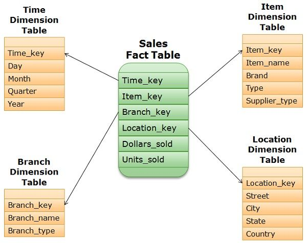
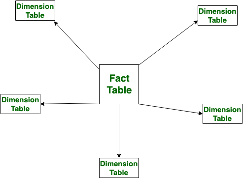
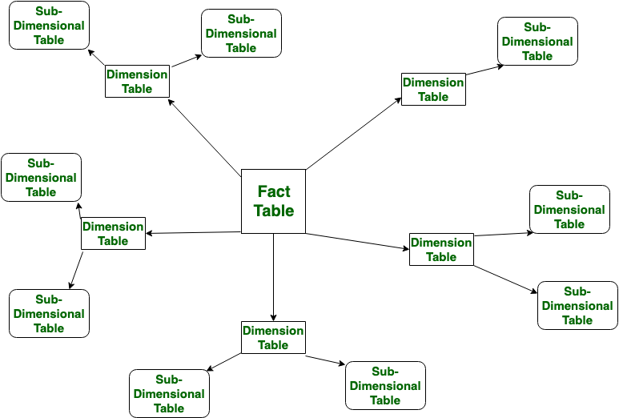
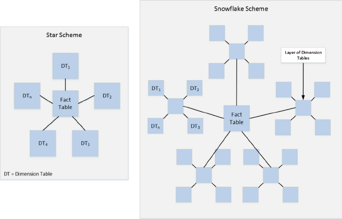

Star Schema:

Star Schema is a type of multidimensional model used for data warehouses. In a star schema, the fact tables and dimension tables are included. This schema uses fewer foreign-key joins. It forms a star structure with a central fact table connected to the surrounding dimension tables. 

Snowflake Schema:

Snowflake Schema is also a type of multidimensional model used for data warehouses. In the snowflake schema, the fact tables, dimension tables and sub-dimension tables are included. This schema forms a snowflake structure with fact tables, dimension tables and sub-dimension tables.

