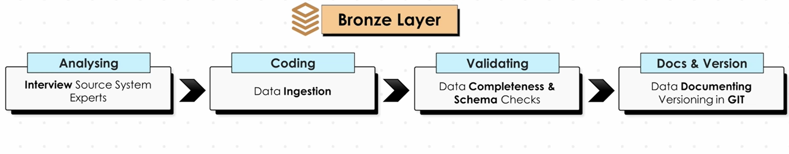
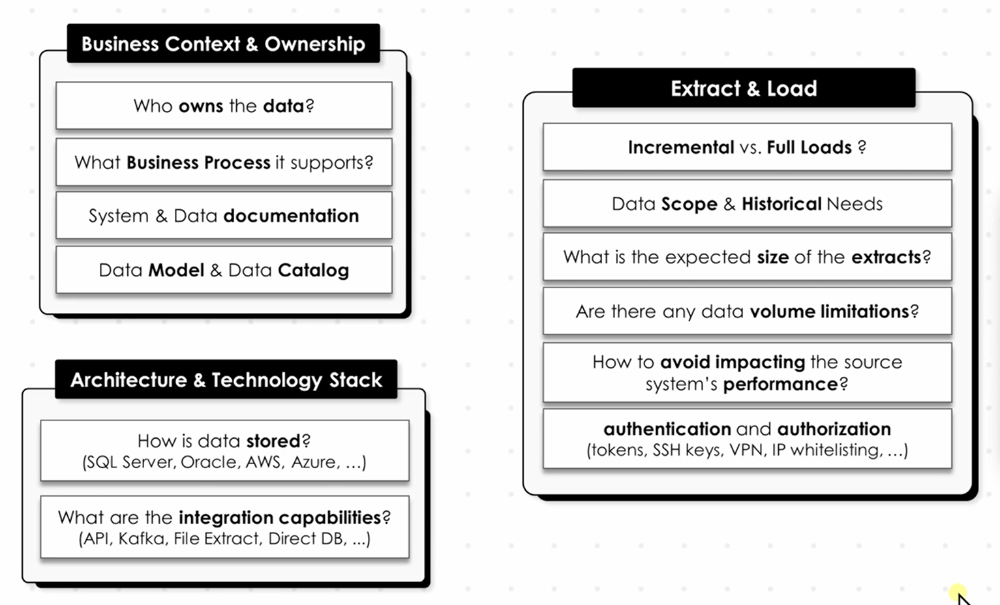

Yes. The two images describe the **Bronze Layer** of a data warehouse from both a planning and implementation perspective.

## 1. What is the Bronze Layer?

The **Bronze Layer is the raw-data layer** of the data warehouse.

Its main purpose is:

> **Bring data from source systems into the warehouse with minimal or no transformation.**

For example, suppose your source system has:

```text
Source MySQL Database
    ↓
customers
orders
products
```

The Bronze layer stores the extracted data in a form that is as close as possible to the source:

```text
Bronze
├── customers
├── orders
└── products
```

You generally **don't perform business transformations here**. The Bronze layer is primarily about **ingestion and preservation**.

---

# 2. Before building Bronze — Analyse the source

The first image shows that before writing ingestion code, you need to understand the source system.

### Business Context & Ownership

You need to know:

**Who owns the data?**

For example:

```text
Customer data → CRM team
Order data    → E-commerce team
Employee data → HR team
```

This matters because you need to know who to contact when the source data changes or has problems.

### What business process does it support?

Understand what the data represents.

For example:

```text
orders → Sales process
customers → Customer management
payments → Payment process
```

This helps you understand why the data exists and how it should eventually be used.

### System & Data Documentation

You need documentation about:

* Source system
* Tables
* Columns
* Data types
* Relationships
* Refresh frequency
* Business meaning

For example:

```text
orders
-----------------------------
order_id       INT
customer_id    INT
order_date     DATETIME
total_amount   DECIMAL
status         VARCHAR
```

### Data Model & Data Catalog

You should understand:

```text
customers
     │
     │ customer_id
     ↓
orders
```

and maintain information about what each table/column means.

---

# 3. Architecture & Technology Stack

The image then asks:

### How is the source data stored?

Examples:

```text
SQL Server
Oracle
MySQL
PostgreSQL
AWS
Azure
```

Your Bronze ingestion strategy depends heavily on the source.

For example:

```text
MySQL → MySQL
```

could use direct database extraction.

But:

```text
API → Data Warehouse
```

requires an API-based ingestion process.

### What are the integration capabilities?

The image gives examples:

```text
API
Kafka
File extraction
Direct database connection
```

So Bronze isn't necessarily populated from a database.

You could have:

```text
SQL Server ──────┐
                 │
REST API ────────┤
                 ├──→ Bronze
CSV files ───────┤
                 │
Kafka ───────────┘
```

---

# 4. Extract & Load

This is one of the most important parts.

The image asks:

### Incremental vs Full Load?

You need to decide how data will be loaded into Bronze.

### Full load

Every time:

```text
Source
  ↓
Extract everything
  ↓
Bronze
```

Example:

```text
Source has 10 million rows

Every day:
10 million rows → Bronze
```

This can be expensive.

### Incremental load

Only extract new/changed records.

For example:

```text
Yesterday:
1,000,000 orders

Today:
10,000 new/updated orders
```

Instead of extracting everything:

```text
10,000 changed records
        ↓
      Bronze
```

Typical mechanisms include:

```text
updated_at timestamp
created_at timestamp
CDC (Change Data Capture)
database transaction logs
watermarks
```

---

# 5. Data Scope & Historical Needs

You need to determine:

> **How much historical data do we need?**

For example:

```text
Bronze requirement:

2022 → 2026
```

Maybe the business wants **5 years of history**.

Then you need to initially perform a historical/full load:

```text
Source
   ↓
2022
2023
2024
2025
2026
   ↓
Bronze
```

After that, incremental loads can keep it updated.

---

# 6. Expected Extract Size

You need to estimate how much data is coming in.

For example:

```text
customers → 500 MB
orders     → 20 GB
products   → 100 MB
logs       → 200 GB
```

This matters because your ingestion architecture must handle the expected volume.

You wouldn't design the same ingestion process for:

```text
10 MB/day
```

and:

```text
10 TB/day
```

---

# 7. Data Volume Limitations

The source may have restrictions.

For example:

```text
API → maximum 1,000 records/request
API → 100 requests/minute
Database → don't run huge queries during business hours
```

Therefore Bronze ingestion needs to respect those limitations.

For an API:

```text
API
 ↓
Page 1 → 1,000 records
Page 2 → 1,000 records
Page 3 → 1,000 records
...
 ↓
Bronze
```

---

# 8. Don't impact the source system

This is very important.

Suppose your production application uses:

```text
Production MySQL
```

and you run:

```sql
SELECT *
FROM orders;
```

against a table containing 500 million rows.

You could potentially impact the production application.

So Bronze ingestion should be designed carefully.

Possible approaches:

```text
Production DB
      ↓
Read replica
      ↓
Bronze
```

or:

```text
Production DB
      ↓
Incremental extraction
      ↓
Bronze
```

rather than constantly running huge queries against production.

---

# 9. Authentication & Authorization

Your ingestion process needs permission to access the source.

The image mentions:

```text
Tokens
SSH keys
VPN
IP whitelisting
...
```

For example:

```text
ETL job
   ↓
Authentication
   ↓
Source Database
   ↓
Extract data
```

You should also follow the principle of **least privilege**.

The ingestion account should ideally have only the permissions it needs.

---

# 10. Bronze Layer Implementation Process

The second image summarizes the actual development process:

```text
Analysing
    ↓
Coding
    ↓
Validating
    ↓
Docs & Versioning
```

### Step 1 — Analysing

The image says:

> Interview Source System Experts

This means talking to people who understand the source system.

For example:

```text
Data Engineer
     ↓
Source DBA / Application Developer
     ↓
Understand tables, relationships,
business rules, refresh patterns
```

---

### Step 2 — Coding

The image says:

> Data Ingestion

Now you implement the actual pipeline.

For example:

```text
MySQL Source
      ↓
Python / Airflow
      ↓
Bronze
```

A simple conceptual pipeline:

```text
Extract
   ↓
Load
   ↓
Bronze
```

Notice that **Bronze generally shouldn't be heavily transformed**.

---

# 11. Step 3 — Validating

The image specifically mentions:

> Data Completeness & Schema Checks

You need to verify that the data arrived correctly.

### Data completeness

Suppose the source has:

```text
Source:
1,000,000 orders
```

Bronze should contain approximately the expected number.

You might check:

```sql
SELECT COUNT(*)
FROM bronze_orders;
```

and compare it with the source.

You can also check:

```text
NULL counts
duplicate records
missing records
unexpected empty files
record counts
```

### Schema checks

Suppose the source says:

```text
order_id → INT
amount   → DECIMAL
```

but suddenly someone changes:

```text
amount → VARCHAR
```

Your ingestion process should detect that.

So you validate:

```text
Column names
Data types
Number of columns
Required columns
New/removed columns
```

---

# 12. Step 4 — Documentation & Versioning

The final stage says:

> Data Documenting
> Versioning in GIT

You should document things such as:

```text
Source:
MySQL production database

Table:
orders

Load type:
Incremental

Frequency:
Every 1 hour

Watermark:
updated_at

Target:
Bronze orders

Owner:
Sales team
```

And your ingestion code/configuration should be version-controlled using Git.

---

# 13. Putting everything together

The complete Bronze process looks like this:

```text
             SOURCE SYSTEM
                  │
        ┌─────────┴─────────┐
        │                   │
     MySQL                 API
        │                   │
        └─────────┬─────────┘
                  ↓
           ANALYSE SOURCE
                  ↓
       ┌─────────────────────┐
       │ Full or Incremental │
       │      Load?          │
       └──────────┬──────────┘
                  ↓
             INGEST DATA
                  ↓
             BRONZE LAYER
                  ↓
       ┌─────────────────────┐
       │ Completeness Checks │
       │ Schema Checks       │
       └──────────┬──────────┘
                  ↓
          Documentation
             + Git
```

## 14. The key idea to remember

Think of Bronze as:

> **"What did the source system give me?"**

Not:

> **"How should I transform this data for the business?"**

For example, source:

```text
customers
--------------------------------
id | name | city | created_date
1  | John | Chennai | 2026-01-01
2  | Ravi | Delhi   | 2026-01-02
```

Bronze:

```text
bronze_customers
--------------------------------
id | name | city | created_date
1  | John | Chennai | 2026-01-01
2  | Ravi | Delhi   | 2026-01-02
```

You preserve the source data.

Then later, **Silver** is where you typically do things like:

```text
cleaning
standardization
deduplication
type corrections
data quality handling
joins
```

And **Gold** is where you typically create business-ready datasets:

```text
sales_summary
customer_metrics
monthly_revenue
product_performance
```

So the overall mental model is:

```text
SOURCE
  │
  │ Extract + Load
  ↓
BRONZE
  │
  │ Clean + Standardize + Transform
  ↓
SILVER
  │
  │ Business Logic + Aggregation
  ↓
GOLD
  │
  ↓
BI / Reports / Analytics / ML
```

**In short:** Bronze is primarily concerned with **getting the source data safely into the warehouse, preserving it, validating that it arrived correctly, and documenting the ingestion process.**


Generically, the Bronze Layer is the first storage layer where data enters a data warehouse/lakehouse.

Sure. Forget the specific MySQL implementation for a moment. **Generically, the Bronze Layer is the first storage layer where data enters a data warehouse/lakehouse.**

## Bronze Layer — Generic Explanation

The Bronze Layer contains **raw or near-raw data copied from source systems**.

The basic flow is:

```text
Source Systems
      ↓
   Extract
      ↓
   Bronze Layer
      ↓
    Silver
      ↓
     Gold
```

### What happens in Bronze?

#### 1. Data is extracted from source systems

Data can come from many places:

```text
Database
API
CSV / Excel
Application
Kafka / streaming
Cloud storage
```

For example:

```text
Production Database
        ↓
      orders
      customers
      products
```

---

#### 2. Data is loaded into Bronze

The extracted data is stored in the Bronze layer.

The important principle is:

> **Keep the data close to its original/source form.**

For example, if the source has:

```text
customer_id | name  | city
------------|-------|-------
101         | John  | Chennai
102         | Ravi  | Delhi
```

Bronze will generally store the same information rather than immediately transforming it into business-friendly structures.

---

#### 3. Minimal transformation

Bronze is **not normally the place for heavy business transformations**.

You might perform basic technical operations such as:

* Converting a file into a readable format
* Adding ingestion timestamp
* Adding source-system information
* Handling basic ingestion metadata
* Making the data physically storable

For example:

```text
customer_id | name | city | ingestion_time | source
101         | John | Chennai | 2026-08-15 10:00 | CRM
```

But you generally **don't do things like**:

```text
Calculate customer lifetime value
Calculate monthly revenue
Apply complex business rules
Create business aggregates
```

Those belong later.

---

#### 4. Full or incremental loading

Bronze ingestion can happen in different ways.

**Full load:**

```text
Source
  ↓
All records
  ↓
Bronze
```

**Incremental load:**

```text
Source
  ↓
Only new/changed records
  ↓
Bronze
```

For large systems, incremental loading is often preferred because you don't repeatedly move the entire dataset.

---

#### 5. Preserve historical/source data

One important purpose of Bronze is **data preservation**.

Suppose today the source contains:

```text
Order 101 → ₹500
```

Tomorrow the source changes it to:

```text
Order 101 → ₹700
```

Depending on the Bronze design, you may retain the original ingestion history so that you can understand **what the source looked like at different points in time**.

This can be very useful for debugging, auditing, and reprocessing.

---

#### 6. Basic validation

You also check whether the ingestion worked correctly.

For example:

```text
Source records     = 100,000
Bronze records     = 100,000
```

You may also check:

```text
✓ File received
✓ Expected columns exist
✓ Record count is reasonable
✓ Data isn't completely empty
✓ Required fields are present
✓ Schema hasn't unexpectedly changed
```

These are generally **ingestion/data-quality checks**, not complex business transformations.

---

## What Bronze should NOT focus on

Think of Bronze as **"raw data storage"**, not the final analytics layer.

You generally don't want Bronze to contain things like:

```text
Monthly Sales Report
Customer Lifetime Value
Top 10 Products
Regional Revenue
Profit Margin
```

Those are derived/business-level datasets.

Instead:

```text
             BRONZE
                │
        Raw source data
                │
                ↓
             SILVER
                │
      Cleaned/standardized
                │
                ↓
              GOLD
                │
       Business-ready data
```

### Easy way to remember

**Bronze = What did the source give us?**

**Silver = How do we clean and standardize it?**

**Gold = What does the business need?**

So, in one sentence:

> **The Bronze Layer is where data is initially ingested from various source systems and stored in a raw or near-raw form, with minimal transformation, basic validation, and enough metadata/history to support downstream processing and reprocessing.**
