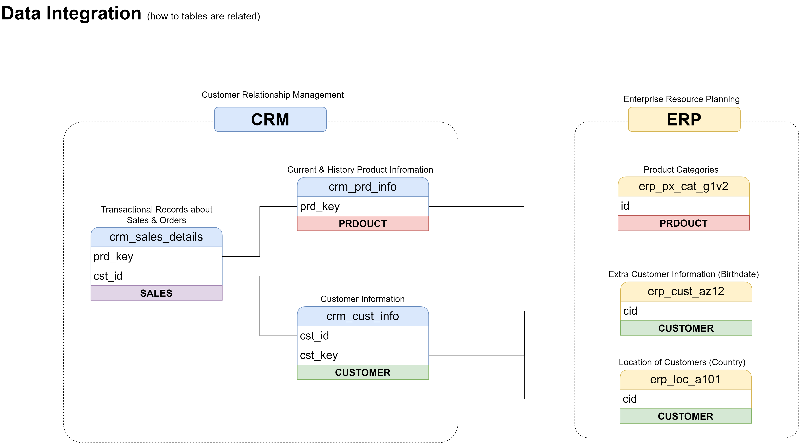

Exactly. **You are understanding the diagram correctly.** But one small wording correction: the value is not literally *flowing* from one table into another at the source level. Rather, **the same business key/value is present in both tables and is used to establish the relationship between them.**

Let's break it down.

### 1. `sales_details.sls_prd_key` → `prod_info.prd_key`

You have:

```text
sales_details
--------------------
sls_ord_num
sls_prd_key
sls_cust_id
sls_sales
...
```

and:

```text
prod_info
--------------------
prd_id
prd_key
prd_nm
prd_cost
...
```

Suppose `sales_details` has:

```text
sls_ord_num    sls_prd_key    sls_cust_id    sls_sales
-------------------------------------------------------
SO1001         P001           101            500
SO1002         P002           102            700
SO1003         P001           103            300
```

And `prod_info` has:

```text
prd_id    prd_key    prd_nm
--------------------------------
1         P001       Laptop
2         P002       Keyboard
3         P003       Mouse
```

The relationship is:

```text
sales_details                    prod_info

sls_prd_key                      prd_key
     P001       ───────────────→   P001
     P002       ───────────────→   P002
     P001       ───────────────→   P001
```

So when you see:

```text
sls_prd_key = P001
```

you go to `prod_info` and find:

```text
prd_key = P001
```

Then you can retrieve:

```text
prd_nm
prd_cost
prd_line
prd_start_dt
prd_end_dt
```

So conceptually:

```text
              SALES
                |
          sls_prd_key
                |
                ↓
            prd_key
                |
                ↓
         PRODUCT INFO
```

---

# 2. Same thing for the customer

You have:

```text
sales_details
----------------
sls_cust_id
```

and:

```text
cust_info
----------------
cst_id
cst_key
cst_firstname
cst_lastname
...
```

Suppose:

```text
sales_details

sls_cust_id
-----------
101
102
103
```

and:

```text
cust_info

cst_id    cst_key       cst_firstname
--------------------------------------
101       C001          John
102       C002          David
103       C003          Sarah
```

Then:

```text
sales_details                    cust_info

sls_cust_id                      cst_id
    101        ───────────────→    101
    102        ───────────────→    102
    103        ───────────────→    103
```

So:

```text
sls_cust_id = cst_id
```

is the relationship.

---

# 3. So your understanding of the diagram is this

You have a **central transaction table**:

```text
                sales_details
               /             \
              /               \
             ↓                 ↓
       sls_prd_key         sls_cust_id
             ↓                 ↓
          prd_key             cst_id
             ↓                 ↓
        prod_info           cust_info
```

In SQL, conceptually, you could join them like:

```sql
SELECT *
FROM sales_details s
JOIN prod_info p
    ON s.sls_prd_key = p.prd_key
JOIN cust_info c
    ON s.sls_cust_id = c.cst_id;
```

That means:

> For every sales transaction, find the product using `sls_prd_key`, and find the customer using `sls_cust_id`.

---

# 4. But notice the naming difference

This is an important ETL concept.

The columns have different names:

```text
sales_details        prod_info
-------------        ---------
sls_prd_key    →     prd_key
```

and:

```text
sales_details        cust_info
-------------        ---------
sls_cust_id    →     cst_id
```

The prefixes tell you **which table/system the column belongs to**, not necessarily that they are different keys.

For example:

```text
sls_prd_key
```

means something like:

> Product key used in the sales table.

while:

```text
prd_key
```

means:

> Product key in the product master table.

They represent the **same product identifier**, allowing the tables to be related.

---

# 5. One subtle but very important point

You said:

> "the same `sls_prod_key` is flowing as `prd_key` into `prod_info`"

Think of it instead as:

> **`sls_prd_key` contains a value that references `prod_info.prd_key`.**

It isn't necessarily being copied into `prod_info`.

For example:

```text
sales_details

sls_prd_key
-----------
P001
P002
P003
```

already exists.

And separately:

```text
prod_info

prd_key
-------
P001
P002
P003
```

already exists.

The database/ETL process uses the matching values to establish the relationship:

```text
sls_prd_key = prd_key
```

This is essentially a **foreign-key → primary/business-key relationship**.

---

## 6. The same idea for customer

```text
sales_details
     |
     | sls_cust_id
     ↓
cust_info
     |
     | cst_id
```

Conceptually:

```text
sls_cust_id ───────→ cst_id
```

So if:

```text
sls_cust_id = 101
```

you look for:

```text
cst_id = 101
```

and retrieve the customer's information.

---

### The easiest way to remember it

```text
SALES TABLE
     |
     | "Who bought?"
     ↓
sls_cust_id ─────→ cst_id
                       |
                       ↓
                  CUSTOMER


SALES TABLE
     |
     | "What did they buy?"
     ↓
sls_prd_key ─────→ prd_key
                       |
                       ↓
                    PRODUCT
```

So **yes: `sls_prd_key` connects to `prd_key`, and `sls_cust_id` connects to `cst_id`.** That's the first level of integration in your diagram.


Yes — this is a very important point. **The arrows are showing the direction of the relationship/reference, not necessarily that data is physically moving from one table to another.**

Look at your diagram:

```text
sales_details
      |
      | sls_prd_key
      ↓
  prod_info
```

Why does the arrow start from `sales_details`?

Because **`sales_details` is the table that contains the key used to find a product in `prod_info`.**

---

## Think of it as a question

A row in `sales_details` says:

> "I have a product key. Which product does this belong to?"

For example:

```text
sales_details

sls_ord_num    sls_prd_key    sls_cust_id
------------------------------------------
SO1001         P001           101
```

The `sales_details` row has:

```text
sls_prd_key = P001
```

So we follow the relationship:

```text
sales_details
     |
     | P001
     ↓
prod_info
```

and find:

```text
prod_info

prd_key     prd_nm
-------------------
P001        Laptop
```

So the arrow is basically saying:

> **"Use the key in this table to look up information in that table."**

---

# Same thing with the customer

You have:

```text
sales_details
      |
      | sls_cust_id
      ↓
cust_info
```

Suppose:

```text
sales_details

sls_cust_id = 101
```

We follow that relationship to:

```text
cust_info

cst_id = 101
cst_firstname = John
cst_lastname = Smith
```

So:

```text
sales_details
     |
     | "Who is customer 101?"
     ↓
cust_info
```

---

# Why doesn't the arrow go the other way?

You **could conceptually navigate the relationship in the other direction**, but the diagram is choosing to show the relationship from the **transaction table toward the master/reference tables**.

Think about the nature of the data.

### `sales_details`

This represents an **event/transaction**:

> Customer 101 bought Product P001.

### `cust_info`

This represents the **customer entity**:

> Customer 101 is John Smith.

### `prod_info`

This represents the **product entity**:

> Product P001 is a Laptop.

So:

```text
                 "What was sold?"
                        |
                        ↓
                 sales_details
                   /       \
                  /         \
                 ↓           ↓
           prod_info     cust_info
           "What?"       "Who?"
```

The sales table is therefore the **transaction that references the master data**.

---

# This is also related to foreign keys

Suppose:

```text
sales_details
----------------
sls_cust_id
101
```

and:

```text
cust_info
----------------
cst_id
101
```

You can think of:

```text
sales_details.sls_cust_id
             |
             | references
             ↓
       cust_info.cst_id
```

`sl​s_cust_id` is effectively acting as a **foreign key/reference** to the customer record.

Similarly:

```text
sales_details.sls_prd_key
             |
             | references
             ↓
       prod_info.prd_key
```

So the arrows are useful because they visually communicate:

> **The sales transaction contains references to the product and customer master records.**

---

# One more important distinction

Don't interpret the arrow as:

```text
❌ Data physically flows:
sales_details → prod_info
```

Instead interpret it as:

```text
✅ Relationship/reference:
sales_details.sls_prd_key
              ↓
       prod_info.prd_key
```

The actual data may already exist independently in both tables.

When you perform a SQL `JOIN`, you're simply **bringing the related records together**:

```sql
SELECT *
FROM sales_details s
JOIN prod_info p
    ON s.sls_prd_key = p.prd_key;
```

Conceptually:

```text
sales_details             prod_info
-------------             ---------
P001          ─────────→  P001
P002          ─────────→  P002
P001          ─────────→  P001
```

The arrow is therefore a **relationship/navigation arrow**, not a **data movement arrow**.

### In your diagram, remember this:

```text
sales_details
     │
     │ "I reference this product"
     ↓
prod_info

sales_details
     │
     │ "I reference this customer"
     ↓
cust_info
```

That's why the arrows are drawn **from `sales_details` outward**.


Exactly — **these arrows mean something slightly different** from the arrows coming out of `sales_details`.

You now have **two levels of relationships** in your diagram:

```text
LEVEL 1: Within CRM

sales_details
     ↓
prod_info
     ↓
ERP product tables


LEVEL 2: CRM → ERP integration

prod_info
     ↓
ERP product table

cust_info
     ↓
ERP customer tables
```

Let's focus on that second part.

---

# 1. Why does `prod_info` point toward the ERP product table?

Your tables are:

```text
CRM                         ERP

prod_info                   px_cat_g1v2
---------                   -----------
prd_id                      ID
prd_key        ─────────→   ID
prd_nm                      CAT
prd_cost                    SUBCAT
prd_line                    MAINTENANCE
...
```

The idea is:

> **`prod_info` contains the CRM representation of a product, while `px_cat_g1v2` contains additional ERP information about that same product.**

So the Silver integration layer needs to connect them.

Conceptually:

```text
CRM
prod_info
    |
    | "Which ERP product does this represent?"
    ↓
ERP
px_cat_g1v2
```

---

# 2. Why do we need to connect them?

Imagine `prod_info` says:

```text
prd_key = P001
prd_nm = Mountain Bike
prd_cost = 500
prd_line = Mountain
```

That's useful, but ERP has additional information:

```text
px_cat_g1v2

ID = P001
CAT = Bikes
SUBCAT = Mountain Bikes
MAINTENANCE = Yes
```

If we integrate them, we get a richer understanding:

```text
P001
 │
 ├── Product Name: Mountain Bike
 ├── Cost: 500
 ├── Product Line: Mountain
 │
 ├── Category: Bikes
 ├── Subcategory: Mountain Bikes
 └── Maintenance: Yes
```

So the arrow means:

> **"Use the product identity from CRM to find the corresponding product information in ERP."**

---

# 3. The same thing happens with `cust_info`

Your CRM table:

```text
cust_info
---------
cst_id
cst_key
cst_firstname
cst_lastname
cst_marital_status
cst_gndr
cst_create_date
```

ERP has:

```text
cust_az12
---------
CID
BDATE
GEN
```

and:

```text
loc_a101
---------
CID
CNTRY
```

So conceptually:

```text
CRM
cust_info
    |
    | "Which ERP customer is this?"
    ↓
ERP
cust_az12
    |
    ↓
ERP
loc_a101
```

---

# 4. What is actually being integrated?

This is the key idea.

CRM might know:

```text
Customer
---------
cst_key = C001
firstname = John
lastname = Smith
gender = M
```

ERP might know:

```text
Customer
---------
CID = C001
BDATE = 1995-10-10
```

and:

```text
Customer
---------
CID = C001
CNTRY = India
```

The Silver layer recognizes:

```text
             SAME CUSTOMER
                  │
        ┌─────────┼─────────┐
        ↓         ↓         ↓
      CRM       ERP       ERP
      info     birth     location
```

So we can create an integrated customer view:

```text
C001
 │
 ├── John
 ├── Smith
 ├── Male
 ├── 1995-10-10
 └── India
```

---

# 5. Why is the arrow going CRM → ERP?

This is the important distinction from your previous question.

When you had:

```text
sales_details → prod_info
```

it meant:

> **The transaction references the product.**

But when you have:

```text
prod_info → px_cat_g1v2
```

it means:

> **The CRM product is being matched with its corresponding ERP product information.**

And:

```text
cust_info → cust_az12
```

means:

> **The CRM customer is being matched with its corresponding ERP customer information.**

So the arrows are showing **how the integration is being navigated/established**, not necessarily physical data movement.

---

# 6. Think of the whole diagram as a chain

Now your entire model makes much more sense:

```text
                    CRM
                     │
          ┌──────────┼───────────┐
          ↓          ↓           ↓
     cust_info   prod_info   sales_details
          ↑          ↑           ↑
          │          │           │
          │          │           │
     Customer      Product     Transaction
          │          │
          ↓          ↓
        ERP        ERP
          │          │
     ┌────┴────┐    ↓
     ↓         ↓  px_cat_g1v2
 cust_az12  loc_a101
```

But remember the **logical direction**:

```text
sales_details
     │
     ├────→ prod_info
     │
     └────→ cust_info


prod_info
     │
     └────→ ERP product information


cust_info
     │
     ├────→ ERP customer information
     │
     └────→ ERP location information
```

---

# 7. The most important thing: CRM and ERP are separate systems

This is why the arrows are necessary.

Before integration:

```text
CRM SYSTEM                         ERP SYSTEM

Customer C001                      Customer C001
John Smith                         DOB: 10-10-1995
Male                               Country: India


Product P001                       Product P001
Mountain Bike                      Category: Bikes
Cost: 500                          Subcategory: Mountain
```

They are **separate sources**.

The Silver layer says:

> "These records actually represent the same real-world customer/product."

So:

```text
CRM Customer ─────────→ ERP Customer
CRM Product  ─────────→ ERP Product
```

After integration:

```text
              UNIFIED CUSTOMER
                     │
          ┌──────────┼──────────┐
          ↓          ↓          ↓
        CRM         ERP        ERP
        Name       Birthdate   Country


               UNIFIED PRODUCT
                     │
          ┌──────────┼──────────┐
          ↓          ↓          ↓
        CRM         ERP        ERP
       Product     Category   Maintenance
```

---

## One sentence to remember

**`sales_details → prod_info/cust_info` means "this transaction references this master data."**

**`prod_info/cust_info → ERP tables` means "this CRM product/customer is being matched and enriched with corresponding information from the ERP system."**

And **all of this is happening logically in the Silver integration model to create one unified view of the business entities.**
